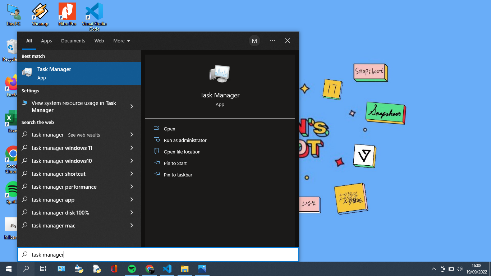

Nama : Maysarah 
NIM : 2110131120006  

 <h2>TUGAS 3 KOMPONEN SISTEM OPERASI, LAYANAN SISTEM OPERASI DAN SISTEM CALL<h/2>
  

### **KOMPONEN SISTEM OPERASI**

Sebuah sistem operasi dapat dibagi menjadi beberapa komponen. Sekurangnya ada empat komponen manajemen utama yaitu:

- Manajemen Proses
- Manajemen Memori
- Manajemen Sistem Berkas
- Manajemen Masukan/Keluaran

Selain keempat komponen diatas, Avi Sillberchatz dkk menambahkan beberapa komponen seperti:

- Manajemen Penyimpanan Sekunder
- Manajemen Sistem Operasi
- Manajemen Jaringan
- Command-Interpreter System

Berikut beberapa contoh dari komponen sistem operasi:
1. Manajemen Proses  

Cara untuk melihat dan mengukur setiap proses yang berjalan di laptop bisa dengan Task Manager.

Untuk membuka task manager, bisa cari di eksplorer dengan mengetikkan "task manager" atau klik windows+shift+ESC. Pada task manager menampilkan program apa saja yang sedang berjalan. Dalam tampilan ini juga menunjukkan kolom informasi mengenai semua proses yang berjalan, antara lain ada kolom CPU, memory, disk, network dan lain sebagianya

Jika ingin mengakhiri suatu program yang sedang berjalan, bisa dengan mengklik programnya kemudian klik <i>end task</i> dipojok bawah kanan atau dengan klik kanan pada touchpad kemudian pilih <i>end task</i>

  

2. Manajemen Sistem Berkas

Cara untuk membuat folder pada komputer/laptop.

Hal yang pertama kali harus kita lakukan adalah menuju file explorer, bisa dengan cara mengetikkan "file eksplorer" pada pencarian. Selain dengan cara dibawah, kita juga dapat mengklik langsung pada shortcut file explorer yang terletak di bar bawah atau mengklik shortcut This PC pada laptop untuk membuka file explorer.

Setelah itu akan muncul tampilan seperti gambar di bawah ini

Selanjutnya pilih tempat menyimpan folder yang akan dibuat. Misal kita pilih tempat penyimpannya di Documents

Setelah itu klik <b>New Folder</b> pada bagian atas atau bisa juga dengan klik tombol kanan pada mouse kemudian pilih new, lalu klik folder.

Setelah di klik, akan muncul folder baru seperti pada gambar dibawah. Kita bisa mengganti nama pada folder baru tersebut atau tetap menggunakan nama new folder. Sampai pada tahap ini folder baru berhasil dibuat. 

  

3. Manajemen Masukan / Keluaran

Sistem ini sering disebut dengan device manager. Menyediakan device driver yang umum sehingga operasi Masukan / Keluaran dapat seragam (membuka, membaca, menulis, menutup). 
Contohnya penggunaan flashdisk.

Masukkan flashdisk pada port USB di laptop. Setelah itu akan muncul ikon seperti gambar dibawah

Jika ingin melepaskan flasdisk dari port USB jangan lupa untuk eject terlebih dahulu agar data yang masih terhubung pada laptop tetap aman.

  

### **LAYANAN SISTEM OPERASI**

Berikut beberapa contoh layanan sistem operasi yang ada pada Windows:

1. Pembuatan Program dengan Notepad

Kita bisa membuat sebuah program dengan menggunakan fitur sederhana bawaan Windows yaitu notepad. Cara penggunaannya adalah yang pertama buka terlebih dahulu aplikasinya, bisa dicari di kolom pencarian.

Setelah itu akan muncul tampilan seperti gambar dibawah, kita perlu memahami beberapa kode seperti <i>echo</i> (kode ini dipakai untuk membuat teks biasa di aplikasi) dan <i>:</i> untuk membuat baris kosong.

Setelahnya kita bisa menyimpan program yang sudah dibuat, lalu program bisa dijalankan.

2. Meng-eksekusi Program dengan Windows Run

Kita bisa menggunakan Windows+R untuk menjalankan suatu program, seperti gambar di bawah ini kita akan menjalankan program untuk mengetik/menulis

Setelah itu klik ENTER/OK.

Program sudah bisa kita jalankan.  

3. Mengunci perangkat (laptop/komputer)

Kita bisa mengunci perangkat dengan cara mengaturnya di settings, pertama buka terlebih dahulu settings

Selanjutnya, klik accounts.

Kemudian, klik Sign-in options, disini kita bisa memilih ingin fitur lock akun seperti apa.

Disini saya setting menggunakan password.

Setelah itu akan ada settings untuk foto profil, kemudian klik finish. Password sudah terpasang.
  

### **SYSTEM CALL**

Berikut beberapa contoh system call yang ada pada Windows:

1. Membuat folder di Command Prompt (CMD)

Pertama, buka Command Prompt di komputer/laptop dengan cara mencari di kolom pencarian seperti gambar di bawah atau tekan Windows + R, lalu ketikkan cmd kemudian klik Ok.

Ketika Command Prompt terbuka, drive yang aktif defaultnya adalah (C:). Jika ingin mengubah drive (C:) ke drive (D:), maka tinggal ketikkan D: kemudian Enter, maka kita akan berpindah ke drive (D:). 
Jika ingin membuat folder baru, maka bisa menggunakan perintah mkdir [nama_folder]. Misal kita akan membuat folder DATA, maka ketikkan perintah mkdir DATA kemudian Enter.

  

2. Menghapus folder di Command Prompt (CMD)

Pertama, buka Command Prompt di komputer/laptop dengan cara mencari di kolom pencarian seperti gambar di bawah atau tekan Windows + R, lalu ketikkan cmd kemudian klik Ok.

Setelah jendela Command Prompt terbuka, masukkan perintah ‘del' diikuti dengan lokasi folder yang ingin dihapus, setelah itu klik ENTER. Contohnya seperti gambar di bawah ini.

  

3. Mengunci Folder di Laptop Dengan CMD

Cara yang pertama yaitu, kalian bisa buka CMD atau dengan menekan logo Windows + R.

Lalu, masuk ke partisi di mana folder yang ingin dikunci berada.Kemudian, ketik perintah berikut cacls [Nama Folder] /p everyone:n. Maka, folder tersebut akan langsung terkunci. 
Untuk membuka kunci folder ganti "n" menjadi "f" seperti: Cacls [Nama Folder] /p everyone:f.

