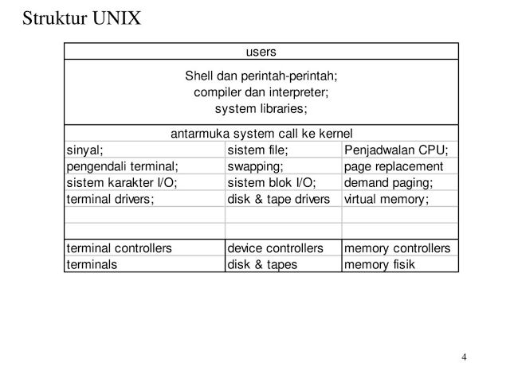
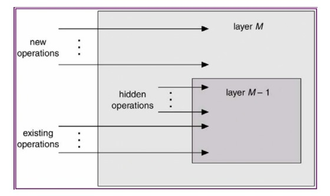
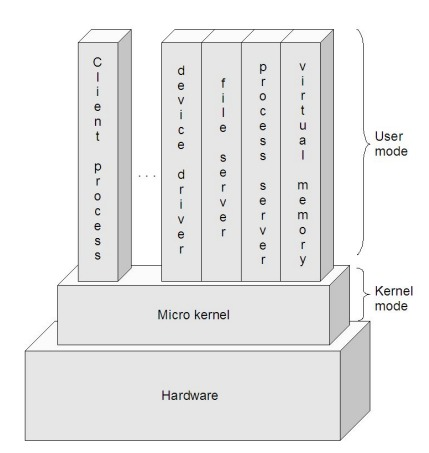

Nama: Maysarah 
NIM : 2110131120006  

<h1 align="center"><b>STRUKTUR SISTEM OPERASI</b></h1>

Sistem operasi modern adalah suatu sistem yang besar dan kompleks. Dan tentu saja proses mendesain
sistem operasi bukanlah pekerjaan mudah. Karena itu, didalam desain sistem operasi digunakan
suatu struktur agar sistem tersebut bisa dipelajari dengan mudah. digunakan, dan dikembangkan
ebih lanjut. Ada beberapa pendekatan/model yang digunakan, seperti struktur sederhana, struktur berlapis, dan mikro kernel.

  

1. **STRUKTUR SEDERHANA**

Pada awalnya, sistem operasi dimulai sebagai sistem yang kecil, sederhana, dan terbatas. Lama kelamaan, sistem operasi semakin berkembang menjadi suatu sistem yang lebih besar dari awalnya. Dalam perkembangannya, ada sistem yang terstruktur dengan kurang baik, dan ada juga yang baik.
Contoh sistem yang terstruktur kurang baik adalah MS-DOS. Sistem operasi ini dirancang sedemikian rupa agar mampu berjalan pada hardware yang terbatas. Memang memiliki struktur, tapi belum
terbagi-bagi dalam modul-modul, dan interface serta fungsionalitas tidak begitu jelas batasannya.
Begitu pula dengan UNIX, yang pada awalnya juga terbatas oleh hardware yang ada. Sistem ini dapat dibagi menjadi dua bagian, yaitu kernel dan program sistem. Kernel sendiri dapat dibagi menjadi dua bagian, yaitu device driver dan interface, yang kemudian terus berkembang seiring dengan perkembangan UNIX. Berikut ini adalah skema struktur UNIX.

 

Versi-versi UNIX selanjutnya dirancang agar mampu bekerja dengan hardware yang lebih baik. Begitu pula dengan strukturnya, yang dibuat makin modular.
  

2. **STRUKTUR BERLAPIS**

Lapisan-lapisan sistem operasi adalah suatu abstraksi dari enkapsulasi sekumpulan struktur data dalam
sistem operasi. Lapisan-lapisan yang berada di atas bisa mengakses operasi-operasi yang tersedia di lapisan-lapisan bawahnya.

Struktur Sistem Operasi Layered pada dasarnya dibuat dengan menggunakan pendekatan top-down, semua fungsi ditentukan dan dibagi menjadi komponen komponen. Modularisasi sistem dilakukan dengan cara memecah sistem operasi menajdi beberapa lapis (tingkat). Lapisan terendah (layer 0) adalah perangkat keras dan lapisan teratas (layer N) adalah user interface. Dengan system modularisasi, setiap lapisan mempunyai fungsi (operasi) tertentu dan melayani lapisan yang lebih rendah.

Struktur berlapis dimaksudkan untuk mengurangi kompleksitas rancangan dan implementasi sistem operasi.

Menurut Tanenbaum dan Woodhull, sistem terlapis terdiri dari enam lapisan, yaitu:
- **Lapis 5** – The operator 
Berfungsi untuk pemakai operator.
- **Lapis 4** – User programs 
Berfungsi untuk aplikasi program pemakai.
- **Lapis 3** – I/O management 
Berfungsi untuk menyederhanakan akses I/O pada level atas.
- **Lapis 2** - Operator-operator communication 
Berfungsi untuk mengatur komunikasi antar proses.
- **Lapis 1** -Memory and drum management 
Berfungsi untuk mengatur alokasi ruang memori atau drum magnetic.
- **Lapis 0** - Processor allocation and multiprogramming 
Berfungsi untuk mengatur alokasi pemroses dan switching, multi programming dan pengaturan prosessor.
 

Stallings memberi model yang lebih detail, sebagai berikut:
- <b>Lapisan 1</b>. Berisi berbagai sirkuit elektronik, misal register, memory cells, dan logic gate.
- **Lapisan 2**. Berisi instruksi prosesor, misal instruksi aritmatika, instruksi transfer data, dsb.
- **Lapisan 3**. Penambahan konsep seperti prosedur/subrutin, maupun fungsi yang me-return nilai
tertentu.
- **Lapisan 4**. Penambahan interrupt.
- **Lapisan 5**. Program sebagai sekumpulan instruksi yang dijalankan oleh prosesor.
- **Lapisan 6**. Berhubungan dengan secondary storage device, yaitu membaca/menulis head, track,
dan sektor.
- **Lapisan 7**. Menciptakan alamat logika untuk proses. Mengatur hubungan antara main memory,
virtual memory, dan secondary memory.
- **Lapisan 8**. Program sebagai sekumpulan instruksi yang dijalankan oleh prosesor.
- **Lapisan 9**. Berhubungan dengan secondary storage device, yaitu membaca/menulis head,track,
dan sektor.
- **Lapisan 10**. Menciptakan alamat logika untuk proses. Mengatur hubungan antara main memory,
virtual memory, dan secondary memory.
- **Lapisan 11**. Program sebagai sekumpulan instruksi yang dijalankan oleh prosesor.
- **Lapisan 12**. File adalah objek yang memiliki nama dan ukuran. Abstraksi dari lapisan 9.
- **Lapisan 13**. Menyediakan interface agar bisa berinteraksi dengan pengguna. 

Sehingga dapat kita simpulkan bahwa lapisan sistem operasi secara umum terdiri atas 4 bagian, yaitu:

<ol>
<li>Perangkat keras
Lebih berhubungan kepada perancang sistem. Lapisan ini mencakup lapisan 0 dan 1 menurut Tanenbaum, dan level 1 sampai dengan level 4 menurut Stallings.</li>
<li>Sistem operasi
Lebih berhubungan kepada programer. Lapisan ini mencakup lapisan 2 menurut Tanenbaum, dan level 5 sampai dengan level 7 menurut Stallings.</li>
<li>Kelengkapan
Lebih berhubungan kepada programer. Lapisan ini mencakup lapisan 3 menurut Tanenbaum, dan level 8 sampai dengan level 11 menurut Stallings.</li>
<li>Program aplikasi
Lebih berhubungan kepada pengguna aplikasi komputer. Lapisan ini mencakup lapisan 4 dan lapisan 5 menurut Tanebaum, dan level 12 dan level 13 menurut Stallings.
Lapisan n memberi layanan untuk lapisan n+1. Proses-proses di lapisan n dapat meminta layanan lapisan n-1 untuk membangunan layanan bagi lapisan n+1. Lapisan n dapat meminta layanan lapisan n-1. Kebalikan tidak dapat, lapisan n tidak dapat meminta layanan n+1. Masing-masing berjalan di ruang alamat-nya sendiri. Kelanjutan sistem berlapis adalah sistem berstruktur cincin seperti sistem MULTICS. Sistem MULTICS terdiri 64 lapisan cincin dimana satu lapisan berkewenangan berbeda. Lapisan n-1 mempunyai kewenangan lebih dibanding lapisan n. Untuk meminta layanan lapisan n-1, lapisan n melakukan trap. Kemudian, lapisan n-1 mengambil kendali sepenuhnya untuk melayani lapisan n.</li></ol> 

Kelebihan Sistem Berlapis (layered system): 
<ul>
<li>Memiliki rancangan modular, yaitu sistem dibagi menjadi beberapa modul & tiap modul dirancang secara independen.</li>
<li>Pendekatan berlapis menyederhanakan rancangan, spesifikasi dan implementasi sistem operasi.</li></ul>
 

Kekurangan Sistem Berlapis (layered system):
<ul>
<li>Fungsi-fungsi sistem operasi diberikan ke tiap lapisan secara hati-hati.</li></ul> 

Salah satu contoh sistem operasi yang menggunakan Struktur ini adalah THE OS. 

THE OS adalah sistem operasi komputer yang dirancang oleh tim yang dipimpin oleh Edsger W. Dijkstra , dijelaskan dalam monograf pada 1965-1966 dan diterbitkan pada tahun 1968. Dijkstra tidak pernah menyebutkan sistemnya; “THE” hanyalah singkatan dari “Technische Hogeschool Eindhoven”. Sistem THE terutama merupakan sistem batch yang mendukung multitasking tu tidak dirancang sebagai sistem operasi multi-pengguna, Itu jauh seperti SDS 940 , tetapi “rangkaian proses dalam sistem THE statis”.  
Sistem THE rupanya memperkenalkan bentuk pertama dari memori virtual berbasis software ( Electrologica X8 tidak mendukung manajemen memori berbasis perangkat keras), membebaskan programmer dari dipaksa untuk menggunakan lokasi fisik sebenarnya pada memori drum . Ini dilakukan dengan menggunakan compiler ALGOL yang dimodifikasi (satu-satunya bahasa pemrograman yang didukung oleh sistem Dijkstra) untuk “secara otomatis menghasilkan panggilan ke rutin sistem, yang memastikan informasi yang diminta ada di memori, swapping jika diperlukan”. Paged virtual memory juga digunakan untuk buffering data perangkat I / O, dan untuk sebagian besar kode sistem operasi serta hampir semua kompiler ALGOL 60.  
Desain sistem multiprograming THE signifikan untuk penggunaan struktur berlapis, di mana lapisan “lebih tinggi” hanya bergantung pada lapisan “lebih rendah” : 
Lapis-5 : user program 
Lapis-4 : buffering untuk I/O device 
Lapis-3 : operator-console device driver 
Lapis-2 : menejemen memori 
Lapis-1 : penjadwalan CPU 
Lapis-0 : hardware 
  

3. **MIKRO KERNEL**

Kernel adalah komponen sentral dari sistem operasi. Ia mengatur hal-hal seperti <i>interrupt
handler</i> (untuk menyediakan layanan interupsi), <i>process scheduler</i> (membagi-bagi proses dalam
prosesor), <i>memory management, I/O</i>, dan sebagainya. Atau dengan kata lain, ia adalah jembatan antara
<i>hardware</i> dengan <i>software</i>.
 

Cara tradisional untuk membangun sistem operasi adalah dengan membuat kernel monolitis, yaitu
semua fungsi disediakan oleh kernel, dan ini menjadikan kernel suatu program yang besar dan
kompleks.
 

Cara yang lebih modern, adalah dengan menggunakan kernel mikro. Pada awalnya, konsep mikro
kernel dikembangkan pada sistem operasi Mach. Ide dasar dari pengembangan kernel mikro adalah
bahwa hanya fitur-fitur yang perlu saja yang diimplementasikan dalam kernel (mengenai fitur-fitur
apa saja yang perlu diimplementasikan, ini bisa berbeda tergantung desain sistem operasi).
 

Walaupun garis pembatas mengenai apa saja yang berada di dalam dan luar kernel mikro bisa berbeda
antara desain yang satu dengan yang lain, namun ada karakteristik yang umum, yaitu servis-servis yang umumnya menjadi bagian sistem operasi menjadi subsistem eksternal yang bisa berinteraksi satu sama lain dan dengan kernel tentunya. Ini mencakup <i>device driver, file system, virtual memory manager, windowing system, dan security devices</i>. Pendekatan kernel mikro menggantikan pendekatan berlapis yang vertikal tradisional.
 

Komponen-komponen sistem operasi yang berada di luar kernel mikro diimplementasikan sebagai
<i>server process</i> dan berkomunikasi dengan <i>message passing</i> via kernel mikro. Misalnya jika user ingin
membuat berkas baru, dia mengirim pesan ke <i>file system server</i>, atau jika ingin membuat proses baru, dia mengirimkan pesan ke <i>process server</i>.

 Struktur Kernel Mikro

Beberapa kelebihan kernel mikro:
<ul>
<li><b><i>Interface</i> yang seragam.</b> Proses tidak lagi dibedakan, baik antara <i>kernel-level</i> maupun <i>user-level</i>, karena semuanya berkomunikasi via <i>message passing.</i></li>
<li><b><i>Extensibility.</i></b> Bisa menambahkan fitur-fitur baru tanpa perlu melakukan kompilasi ulang.</li>
<li><b><i>Flexibility .</i></b> Fitur-fitur yang sudah ada bisa dikurangi, atau dimodifikasi sesuai dengan kebutuhan sehingga menjadi lebih efisien. Misalnya tidak semua pengguna membutuhkan security
yang sangat ketat, atau kemampuan untuk melakukan distributed computing.</li>
<li><b><i>Portability .</i></b> Pada kernel mikro, semua atau sebagian besar kode yang prosesor-spesifik berada
di dalamnya. Jadi, proses porting ke prosesor lain bisa dilakukan dengan relatif sedikit usaha. Pada
kelompok desktop misalnya, tampaknya dominasi Intel makin kuat. Tapi, sampai seberapa lama
itu bisa bertahan? Karena itulah, portability adalah salah satu isu yang sangat penting.</li>
<li><b><i>Reliability .</i></b> Semakin besar suatu software, maka tentulah semakin sulit untuk menjamin reliability-nya. Desain dengan pendekatan berlapis sangatlah membantu, dan dengan pendekatan kernel mikro bisa lebih lagi. Kernel mikro dapat dites secara ekstensif .Karena dia menggunakan API yang sedikit, maka bisa meningkatkan kualitas code di luar kernel.</li>
<li><b><i>Support for object-oriendted OS .</i></b> Model kernel mikro sangat sesuai untuk mengembangkan
sistem operasi yang berbasis object-oriented. Contoh sistem operasi yang menggunakan kernel
mikro adalah MacOS X dan QNX.</li>

