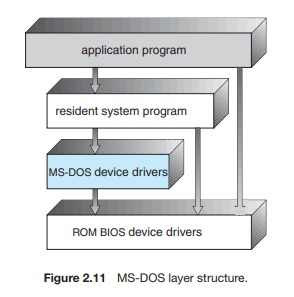
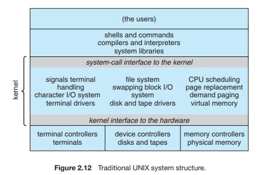
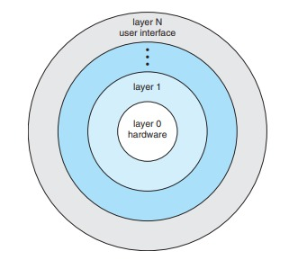
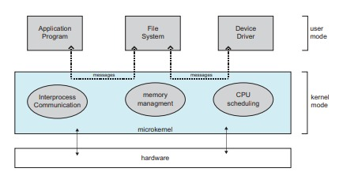

Nama: Maysarah 
NIM : 2110131120006  

<h1 align="center"><b>STRUKTUR SISTEM OPERASI</b></h1> 

Sistem operasi modern adalah suatu sistem yang besar dan kompleks. Dan tentu saja proses mendesain
sistem operasi bukanlah pekerjaan mudah. Karena itu, didalam desain sistem operasi digunakan
suatu struktur agar sistem tersebut bisa dipelajari dengan mudah. digunakan, dan dikembangkan
ebih lanjut. Ada beberapa pendekatan/model yang digunakan, seperti struktur sederhana, struktur berlapis, dan mikro kernel.

  

1. **STRUKTUR SEDERHANA**

Banyak sistem operasi tidak memiliki struktur yang terdefinisi dengan baik. Sering, seperti
sistem dimulai sebagai sistem kecil, sederhana, dan terbatas dan kemudian berkembang lebih jauh
lingkup asli mereka. MS-DOS adalah contoh dari sistem tersebut. Itu awalnya
dirancang dan diimplementasikan oleh beberapa orang yang tidak tahu bahwa itu akan
menjadi begitu populer. Itu ditulis untuk memberikan fungsionalitas paling banyak di
sedikit ruang, sehingga tidak hati-hati dibagi menjadi modul. Gambar 2.11 menunjukkan nya
struktur.

 

Di MS-DOS, antarmuka dan tingkat fungsionalitas tidak dipisahkan dengan baik.
Misalnya, program aplikasi dapat mengakses rutinitas I/O dasar
untuk menulis langsung ke layar dan disk drive. Kebebasan seperti itu meninggalkan MS-DOS
rentan terhadap program yang salah (atau berbahaya), menyebabkan seluruh sistem crash
ketika program pengguna gagal. Tentu saja, MS-DOS juga dibatasi oleh perangkat keras
dari zamannya. Karena Intel 8088 yang ditulisnya tidak menyediakan dual
mode dan tidak ada perlindungan perangkat keras, perancang MS-DOS tidak punya pilihan selain
untuk membiarkan perangkat keras dasar dapat diakses.  
Contoh lain dari penataan terbatas adalah operasi UNIX asli
sistem. Seperti MS-DOS, UNIX awalnya dibatasi oleh fungsionalitas perangkat keras. Dia
terdiri dari dua bagian yang dapat dipisahkan: kernel dan program sistem. Kernel selanjutnya dipisahkan menjadi serangkaian antarmuka dan driver perangkat, yang memiliki:
telah ditambahkan dan diperluas selama bertahun-tahun sebagai UNIX telah berkembang. Kita dapat melihat
sistem operasi UNIX tradisional sebagai berlapis sampai batas tertentu, seperti yang ditunjukkan pada
Gambar 2.12. Semuanya di bawah antarmuka panggilan sistem dan di atas fisik
perangkat keras adalah kernel. Kernel menyediakan sistem file, penjadwalan CPU,
manajemen memori, dan fungsi sistem operasi lainnya melalui sistem
panggilan. Singkatnya, itu adalah sejumlah besar fungsi untuk digabungkan
menjadi satu tingkat.

  

2. **STRUKTUR BERLAPIS**

Suatu sistem dapat dibuat modular dengan banyak cara. Salah satu metode adalah struktur/pendekatan berlapis, di mana sistem operasi dipecah menjadi beberapa lapisan
(tingkat). Lapisan bawah (lapisan 0) adalah perangkat keras; tertinggi (lapisan N) adalah
antarmuka pengguna. Struktur layering ini digambarkan pada Gambar dibawah ini.

 

Lapisan sistem operasi adalah implementasi dari objek abstrak yang dibuat
data dan operasi yang dapat memanipulasi data tersebut. Sebuah tipikal
lapisan sistem operasi — katakanlah, lapisan M — terdiri dari struktur data dan satu set
rutinitas yang dapat dipanggil oleh lapisan tingkat yang lebih tinggi. Lapisan M, pada gilirannya, dapat
menjalankan operasi pada lapisan tingkat yang lebih rendah.

Keuntungan utama dari pendekatan berlapis adalah kesederhanaan konstruksi
dan debugging. Lapisan dipilih sehingga masing-masing menggunakan fungsi (operasi)
dan layanan hanya lapisan tingkat yang lebih rendah. Pendekatan ini menyederhanakan debugging
dan verifikasi sistem.  
Kesulitan utama dengan pendekatan berlapis melibatkan tepat
mendefinisikan berbagai lapisan. Karena sebuah layer hanya dapat menggunakan layer dengan level yang lebih rendah,
perencanaan yang matang sangat diperlukan. Misalnya, driver perangkat untuk dukungan
store (ruang disk yang digunakan oleh algoritme memori virtual) harus lebih rendah
tingkat dari rutinitas manajemen memori, karena manajemen memori
membutuhkan kemampuan untuk menggunakan backing store.

Masalah terakhir dengan implementasi berlapis adalah bahwa mereka cenderung kurang
efisien dibandingkan jenis lainnya. Misalnya, ketika program pengguna menjalankan I/O
operasi, itu mengeksekusi panggilan sistem yang terjebak ke lapisan I/O, yang memanggil
lapisan manajemen memori, yang pada gilirannya memanggil lapisan penjadwalan CPU,
yang kemudian diteruskan ke perangkat keras. Pada setiap lapisan, parameternya mungkin:
dimodifikasi, data mungkin perlu diteruskan, dan sebagainya. Setiap lapisan menambahkan overhead ke
panggilan sistem. Hasil bersihnya adalah panggilan sistem yang membutuhkan waktu lebih lama daripada yang dilakukan
pada sistem yang tidak berlapis.
  

3. **MIKRO KERNEL**

Metode ini menyusun
sistem operasi dengan menghapus semua komponen yang tidak penting dari kernel dan
mengimplementasikannya sebagai sistem dan program tingkat pengguna. Hasilnya lebih kecil
inti. Ada sedikit konsensus mengenai layanan mana yang harus tetap di
kernel dan mana yang harus diimplementasikan di ruang pengguna. Biasanya, bagaimanapun,
mikrokernel menyediakan proses minimal dan manajemen memori, sebagai tambahan
ke fasilitas komunikasi. Gambar di bawah mengilustrasikan arsitektur tipikal
mikrokernel.

 

Fungsi utama dari mikrokernel adalah untuk menyediakan komunikasi antara
program klien dan berbagai layanan yang juga berjalan di ruang pengguna.
 

Salah satu manfaat dari pendekatan mikrokernel adalah membuat perluasan
sistem operasi lebih mudah. Semua layanan baru ditambahkan ke ruang pengguna dan
akibatnya tidak memerlukan modifikasi kernel. Ketika kernel melakukannya
harus dimodifikasi, perubahannya cenderung lebih sedikit, karena mikrokernelnya
kernel yang lebih kecil. Sistem operasi yang dihasilkan lebih mudah untuk port dari satu
desain perangkat keras ke yang lain. Mikrokernel juga memberikan lebih banyak keamanan
dan keandalan, karena sebagian besar layanan berjalan sebagai pengguna—bukan kernel—
proses. Jika layanan gagal, sisa sistem operasi tetap tidak tersentuh
 

Akan tetapi, kinerja mikrokernel dapat menurun karena peningkatan
overhead fungsi sistem. 
 